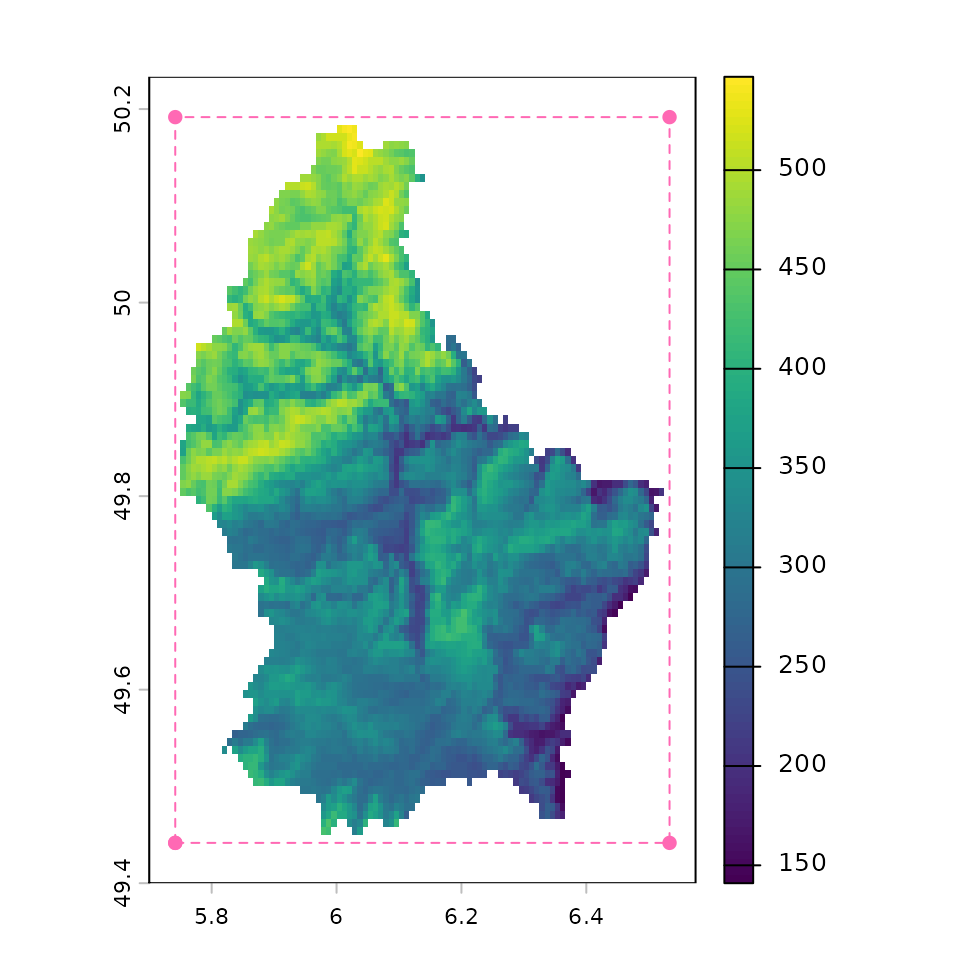
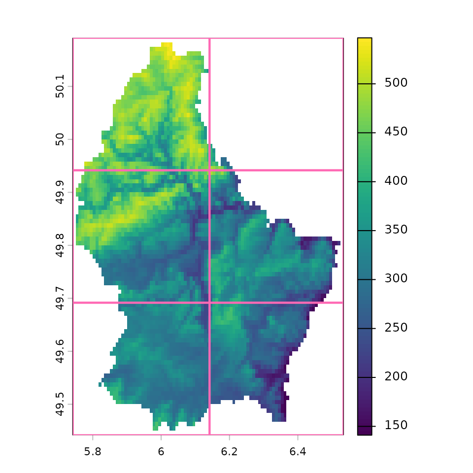
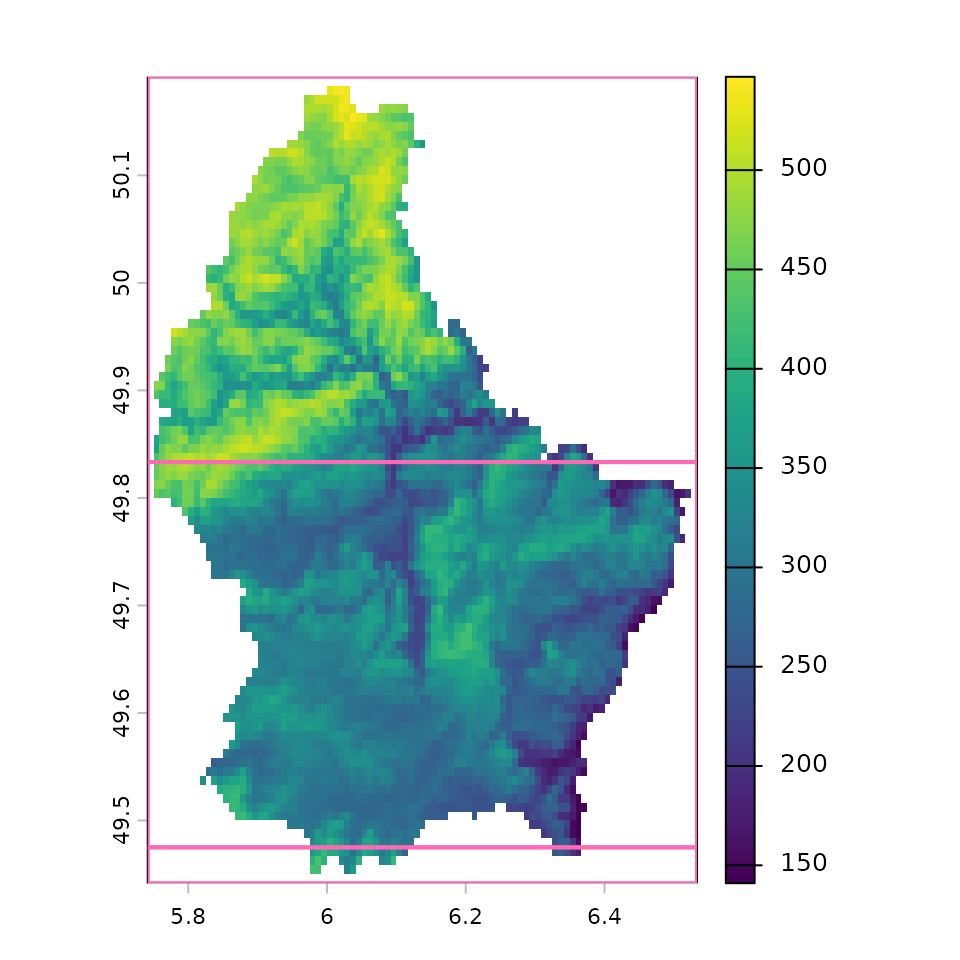
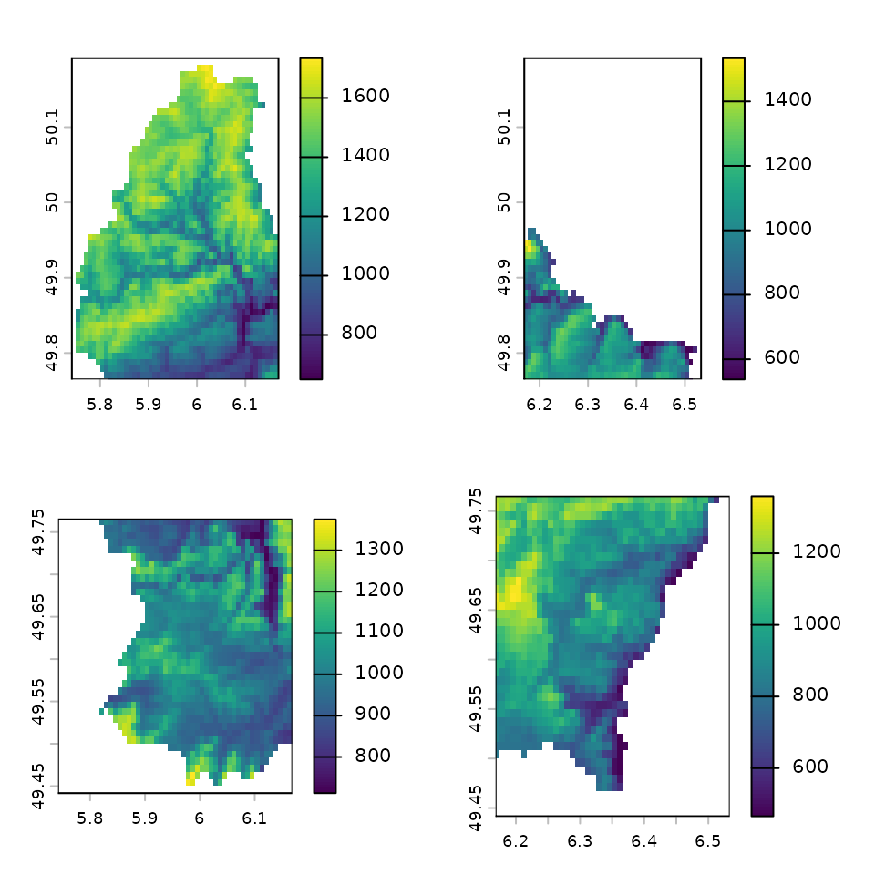

# Dynamic branching with raster tiles

``` r

library(geotargets)
library(targets)
#> Warning: package 'targets' was built under R version 4.6.1
library(terra)
#> terra 1.9.46
```

Computationally intensive raster operations that work in pixel-wise
manner may be handled well with [dynamic
branching](https://books.ropensci.org/targets/dynamic.html#about-dynamic-branching)
over tiled subsets of the raster.
[`tar_terra_tiles()`](https://docs.ropensci.org/geotargets/reference/tar_terra_tiles.md)
is a target factory that enables creating these dynamic branches so
downstream targets can iterate over them. This is useful when, for
example, loading an entire raster into memory and doing computations on
it results in out of memory errors.

In order to use
[`tar_terra_tiles()`](https://docs.ropensci.org/geotargets/reference/tar_terra_tiles.md),
we need to break a raster into smaller pieces. We can do that by
providing **extent**s used by the raster. The concept of extent is
important, so let’s unpack that a bit more.

### What is an extent?

The **extent** describes the four points that cover the area of a
raster. The extent of a raster, `r`, is printed in the summary:

``` r

# example SpatRaster
f <- system.file("ex/elev.tif", package = "terra")
r <- rast(f)
r
#> class       : SpatRaster
#> size        : 90, 95, 1  (nrow, ncol, nlyr)
#> resolution  : 0.008333333, 0.008333333  (x, y)
#> extent      : 5.741667, 6.533333, 49.44167, 50.19167  (xmin, xmax, ymin, ymax)
#> coord. ref. : lon/lat WGS 84 (EPSG:4326)
#> source      : elev.tif
#> name        : elevation
#> min value   :       141
#> max value   :       547
```

But we can get the extent with `ext` (**ext**ent):

``` r

r_ext <- ext(r)
r_ext
#> SpatExtent : 5.7416666666666663, 6.5333333333333332, 49.441666666666663, 50.191666666666663 (xmin, xmax, ymin, ymax)
```

Which maps onto the four corners of the raster here:

``` r

rect_extent <- function(x, ...) {
  rect(x[1], x[3], x[2], x[4], ...)
}
plot_extents <- function(x, ...) {
  invisible(lapply(x, rect_extent, border = "hotpink", lwd = 2))
}
```

``` r

extend(r, 5) |> plot()
lines(r_ext, col = "hotpink", lty = 2)
points(r_ext, col = "hotpink", pch = 16)
```



Some geo-computational operations can be done independently of one
another—we want to take advantage of that, and we can facilitate this by
breaking the raster into smaller pieces, by creating new extents that
describe new subsets of the raster.

We can use this extent information downstream in the analysis to
describe how to break up a raster. This is similar to how we might want
to chunk up a data frame into groups to distribute to different CPU
cores. To help with this, we’ve got some helper functions.

### Helper functions to create multiple extents of a raster

`geotargets` provides three helper functions that take a `SpatRaster`
and output the extents for tiles:

- [`tile_n()`](https://docs.ropensci.org/geotargets/reference/tile_helpers.md),
- [`tile_grid()`](https://docs.ropensci.org/geotargets/reference/tile_helpers.md),
  and
- [`tile_blocksize()`](https://docs.ropensci.org/geotargets/reference/tile_helpers.md)

We will demonstrate these now.

#### `tile_n()`

We can use
[`tile_n()`](https://docs.ropensci.org/geotargets/reference/tile_helpers.md),
which is the simplest of the three. It produces *about* `n` tiles in a
grid.

``` r

r_tile_4 <- tile_n(r, 4)
#> creating 2 * 2 = 4 tile extents
r_tile_4
#> [[1]]
#>      xmin      xmax      ymin      ymax 
#>  5.741667  6.141667 49.816667 50.191667 
#> 
#> [[2]]
#>      xmin      xmax      ymin      ymax 
#>  6.141667  6.533333 49.816667 50.191667 
#> 
#> [[3]]
#>      xmin      xmax      ymin      ymax 
#>  5.741667  6.141667 49.441667 49.816667 
#> 
#> [[4]]
#>      xmin      xmax      ymin      ymax 
#>  6.141667  6.533333 49.441667 49.816667
```

``` r

plot(r)
plot_extents(r_tile_4)
```


``` r

plot(r)
tile_n(r, 6) |> plot_extents()
#> creating 2 * 3 = 6 tile extents
```


#### `tile_grid()`

For more control, use
[`tile_grid()`](https://docs.ropensci.org/geotargets/reference/tile_helpers.md),
which allows specification of the number of rows and columns to split
the raster into. Here we are specify that we want three columns and 1
row:

``` r

r_grid_3x1 <- tile_grid(r, ncol = 3, nrow = 1)
r_grid_3x1
#> [[1]]
#>      xmin      xmax      ymin      ymax 
#>  5.741667  6.008333 49.441667 50.191667 
#> 
#> [[2]]
#>      xmin      xmax      ymin      ymax 
#>  6.008333  6.266667 49.441667 50.191667 
#> 
#> [[3]]
#>      xmin      xmax      ymin      ymax 
#>  6.266667  6.533333 49.441667 50.191667
plot(r)
plot_extents(r_grid_3x1)
```


``` r


plot(r)
tile_grid(r, ncol = 2, nrow = 3) |> plot_extents()
```



#### `tile_blocksize()`

The third included helper is
[`tile_blocksize()`](https://docs.ropensci.org/geotargets/reference/tile_helpers.md),
which tiles by file **block size**. The **block size** is a property of
raster files, and is the number of pixels (in the x and y direction)
that is read into memory at a time. Tiling by multiples of block size
may therefore be more efficient because only one block should need to be
loaded to create each tile target. You can find the blocksize with
`fileBlocksize`:

``` r

fileBlocksize(r)
#>      rows cols
#> [1,]   43   95
```

This tells us that it reads in the raster in 43x95 pixel sizes.

The `tile_blocksize` function is similar to `tile_grid`, except instead
of saying how many rows and columns, we specify in units of blocksize.

If we just run
[`tile_blocksize()`](https://docs.ropensci.org/geotargets/reference/tile_helpers.md)
on `r` we get the extents of the specified blocksize:

``` r

tile_blocksize(r)
#> [[1]]
#>      xmin      xmax      ymin      ymax 
#>  5.741667  6.533333 49.833333 50.191667 
#> 
#> [[2]]
#>      xmin      xmax      ymin      ymax 
#>  5.741667  6.533333 49.475000 49.833333 
#> 
#> [[3]]
#>      xmin      xmax      ymin      ymax 
#>  5.741667  6.533333 49.441667 49.475000
```

Which is the same as specifying blocksize for row and column at unit 1:

``` r

r_block_size_1x1 <- tile_blocksize(r, n_blocks_row = 1, n_blocks_col = 1)
r_block_size_1x1
#> [[1]]
#>      xmin      xmax      ymin      ymax 
#>  5.741667  6.533333 49.833333 50.191667 
#> 
#> [[2]]
#>      xmin      xmax      ymin      ymax 
#>  5.741667  6.533333 49.475000 49.833333 
#> 
#> [[3]]
#>      xmin      xmax      ymin      ymax 
#>  5.741667  6.533333 49.441667 49.475000
plot(r)
plot_extents(r_block_size_1x1)
```



Here the block size is the same size for the first two blocks, and then
a much more narrow block. This is different to the two other tile
methods.

Here the column block size is the full width of the raster.

So we could instead have the blocksize extent be written out to 2 blocks
in a row, and 1 block size for the columns:

``` r

r_block_size_2x1 <- tile_blocksize(r, n_blocks_row = 2, n_blocks_col = 1)
r_block_size_2x1
#> [[1]]
#>      xmin      xmax      ymin      ymax 
#>  5.741667  6.533333 49.475000 50.191667 
#> 
#> [[2]]
#>      xmin      xmax      ymin      ymax 
#>  5.741667  6.533333 49.441667 49.475000
plot(r)
plot_extents(r_block_size_2x1)
```


This only works when the `SpatRaster` points to a file—in-memory rasters
have no inherent block size.

``` r

sources(r)
#> [1] "/github/home/R/x86_64-pc-linux-gnu-library/4.6/terra/ex/elev.tif"
# force into memory
r2 <- r + 0
sources(r2)
#> [1] ""
# this now errors
tile_blocksize(r2)
#> Error:
#> ! [aggregate] values in argument 'fact' should be > 0
```

## How to run targets examples from vignettes

The way targets typically works is you write a file named `_targets.R`,
which describes the pipeline. See for example, the [`_targets.R` file in
the demo-geotargets
repo](https://github.com/njtierney/demo-geotargets/blob/main/_targets.R).

However, in order to demonstrate many of the features with `targets` and
`geotargets`, we don’t want to have to create many `_targets.R` files.
So instead we use a targets function
[`targets::tar_script()`](https://docs.ropensci.org/targets/reference/tar_script.html).
This allows you to write the code you would have put in a `_targets.R`
file.

What this means for you is you can essentially just “copy and paste” the
examples we provide in this vignette. When running the `tar_script`
code, it will ask you each time if you want to overwrite the
`_targets.R` file. This means if you are exploring these examples and
copying the entire examples, it is worthwhile doing this in a separate
repository to avoid overwriting your own `_targets.R` file.

### Example targets pipeline

When developing a `targets` pipeline using
[`tar_terra_tiles()`](https://docs.ropensci.org/geotargets/reference/tar_terra_tiles.md)
with
[`tile_blocksize()`](https://docs.ropensci.org/geotargets/reference/tile_helpers.md),
it’s a good idea to figure out how many tiles
[`tile_blocksize()`](https://docs.ropensci.org/geotargets/reference/tile_helpers.md)
will create before implementing
[`tar_terra_tiles()`](https://docs.ropensci.org/geotargets/reference/tar_terra_tiles.md).
We’ll start by making a bigger raster to experiment with using
[`terra::disagg()`](https://rspatial.github.io/terra/reference/disaggregate.html),
(which makes a higher resolution raster by breaking the pixels into
smaller pixels), and making multiple layers.

``` r

targets::tar_script({
  # contents of _targets.R
  library(targets)
  library(geotargets)
  library(terra)
  geotargets_option_set(gdal_raster_driver = "COG")
  list(
    tar_target(
      raster_file,
      system.file("ex/elev.tif", package = "terra"),
      format = "file"
    ),
    tar_terra_rast(
      r,
      disagg(rast(raster_file), fact = 10)
    ),
    # add more layers
    tar_terra_rast(
      r_big,
      c(r, r + 100, r * 10, r / 2),
      memory = "transient"
    )
  )
})
```

``` r

tar_make()
#> terra 1.9.46
#> + raster_file dispatched
#> ✔ raster_file completed [1ms, 7.99 kB]
#> + r dispatched
#> ✔ r completed [10ms, 822.78 kB]
#> + r_big dispatched
#> ✔ r_big completed [44ms, 4.05 MB]
#> ✔ ended pipeline [550ms, 3 completed, 0 skipped]
#> Warning message:
#> package ‘targets’ was built under R version 4.6.1
tar_load(r_big)
tile_blocksize(r_big)
#> [[1]]
#>      xmin      xmax      ymin      ymax 
#>  5.741667  6.168333 49.765000 50.191667 
#> 
#> [[2]]
#>      xmin      xmax      ymin      ymax 
#>  6.168333  6.533333 49.765000 50.191667 
#> 
#> [[3]]
#>      xmin      xmax      ymin      ymax 
#>  5.741667  6.168333 49.441667 49.765000 
#> 
#> [[4]]
#>      xmin      xmax      ymin      ymax 
#>  6.168333  6.533333 49.441667 49.765000
```

Four tiles is reasonable, so we’ll go with that. Note that we have to
ensure the `r_big` target is not in-memory for
[`tar_terra_tiles()`](https://docs.ropensci.org/geotargets/reference/tar_terra_tiles.md),
so we set the targets option `memory = "transient"`. See the [targets
documentation on
memory](https://docs.ropensci.org/targets/reference/tar_target.html#arg-memory)
for details.

The process that happens from here can be thought of as
`split-apply-combine`.

- **Split** the raster into pieces using the
  [`tar_terra_tiles()`](https://docs.ropensci.org/geotargets/reference/tar_terra_tiles.md)
  target factory
  - This returns tiles whose **extents** are created by one of the tile
    functions described above
    ([`tile_n()`](https://docs.ropensci.org/geotargets/reference/tile_helpers.md),
    [`tile_grid()`](https://docs.ropensci.org/geotargets/reference/tile_helpers.md),
    or
    [`tile_blocksize()`](https://docs.ropensci.org/geotargets/reference/tile_helpers.md)),
    supplying this to `tile_fun`.
- **Apply** a function to the rasters.
  - This can be any function that would work on a raster, in the case
    below we use the `app` function from `terra`, which applies some
    function to the cells of a raster.
  - To do this we use
    [`tar_terra_rast()`](https://docs.ropensci.org/geotargets/reference/tar_terra_rast.md)
    and then supply the `pattern = map(tiles)`, where `tiles` is the
    name of the target created with
    [`tar_terra_tiles()`](https://docs.ropensci.org/geotargets/reference/tar_terra_tiles.md).
    You can think of `pattern = map(tiles)` as saying: “Do the task for
    each of the tiles we have specified and return them as a list”
- **Combine** the list of rasters together.
  - In this case we use
    [`tar_terra_rast()`](https://docs.ropensci.org/geotargets/reference/tar_terra_rast.md)
    and use
    [`merge()`](https://rspatial.github.io/terra/reference/merge.html)
    on the tiles.

``` r

targets::tar_script({
  # contents of _targets.R
  library(targets)
  library(geotargets)
  library(terra)
  geotargets_option_set(gdal_raster_driver = "COG")
  tar_option_set(memory = "transient")
  list(
    tar_target(
      raster_file,
      system.file("ex/elev.tif", package = "terra"),
      format = "file"
    ),
    tar_terra_rast(
      r,
      disagg(rast(raster_file), fact = 10)
    ),
    tar_terra_rast(
      r_big,
      c(r, r + 100, r * 10, r / 2),
      memory = "transient"
    ),
    # split
    tar_terra_tiles(
      tiles,
      raster = r_big,
      tile_fun = tile_blocksize,
      description = "split raster into tiles"
    ),
    # apply
    tar_terra_rast(
      tiles_mean,
      app(tiles, \(x) mean(x, na.rm = TRUE)),
      pattern = map(tiles),
      description = "some computationaly intensive task performed on each tile"
    ),
    # combine
    tar_terra_rast(
      merged_mean,
      merge(sprc(tiles_mean)),
      description = "merge tiles into a single SpatRaster"
    )
  )
})
```

``` r

tar_make()
#> terra 1.9.46
#> + tiles_exts dispatched
#> ✔ tiles_exts completed [6ms, 152 B]
#> + tiles declared [4 branches]
#> ✔ tiles completed [56ms, 2.32 MB]
#> + tiles_mean declared [4 branches]
#> ✔ tiles_mean completed [7.5s, 396.44 kB]
#> + merged_mean dispatched
#> ✔ merged_mean completed [17ms, 879.91 kB]
#> ✔ ended pipeline [8.2s, 10 completed, 3 skipped]
#> Warning message:
#> package ‘targets’ was built under R version 4.6.1
```

We can see from
[`tar_make()`](https://docs.ropensci.org/targets/reference/tar_make.html)
output above and the plots below that `tiles` and `tiles_mean` are both
patterns with four branches each.

``` r

library(terra)
tar_load(tiles_mean)
op <- par(mfrow = c(2, 2))
for (i in seq_along(tiles_mean)) {
  plot(tiles_mean[[i]])
}
```



``` r

par(op)
```

And combined, they make the full plot again.

``` r

plot(tar_read(merged_mean))
```


